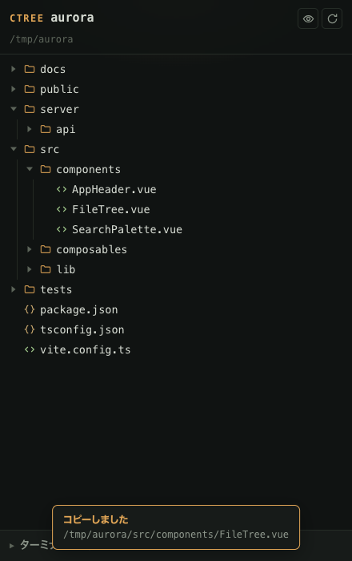
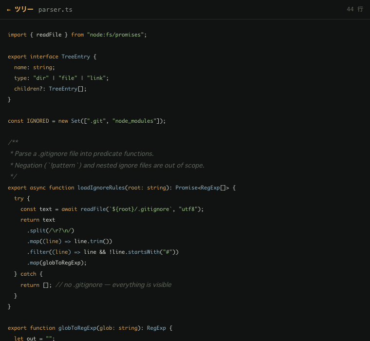
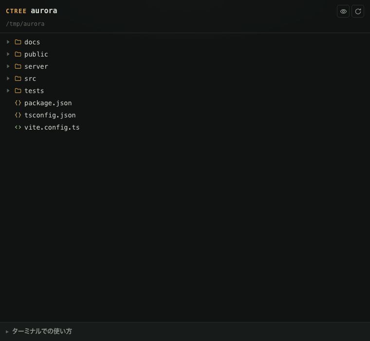
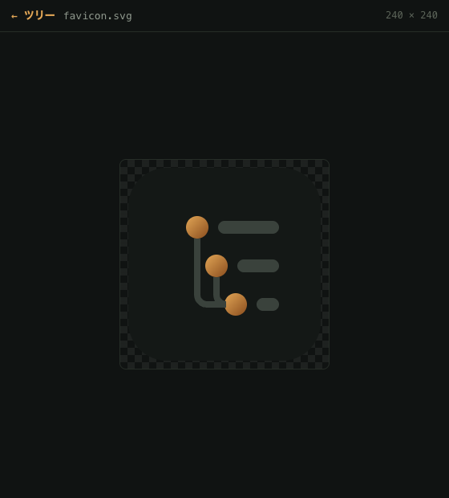
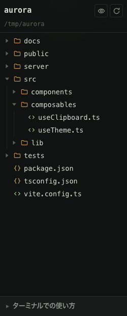

<div align="center">


# ctree

**[cmux](https://cmux.io) のターミナルに住む、エディタ風ファイルツリー。**
ファイルをクリックすると、絶対パスがクリップボードに入ります。

[](LICENSE)
[](https://nodejs.org)
[](package.json)
[](#動作要件)

[English](README.md) | 日本語



</div>

---

## なぜ作ったか

ターミナル常駐の AI コーディングエージェント (Claude Code など) は**絶対パス**を頻繁に要求します。 ところが素のシェルにはディレクトリを「見る」手段も、 パスをワンクリックで拾う手段もありません。 `ctree` は任意のディレクトリを、 エージェントのすぐ隣の cmux ブラウザペインに、 見慣れたエディタのサイドバーとして描画します:

- 🌲 **エディタ風ツリー** — 開閉、種別アイコン、インデントガイド、ダーク/ライト両対応
- 📋 **クリック = コピー** — ワンクリックで絶対パスがクリップボードへ。そのままプロンプトに貼れる
- 📝 **markdown ビューア** — GitHub 風レンダリング + ライブリロード
- 🎨 **コードビューア** — 190+ 言語のシンタックスハイライト、word wrap 常時有効
- 🖼 **画像ビューア** — PNG / JPEG / SVG / WebP / GIF をチェッカーボード上に表示。PDF はネイティブ描画
- 🔄 **ライブ更新** — ファイル変更は SSE でツリーに即反映。手動リロード不要
- 🙈 **賢いフィルタ** — `.gitignore` 尊重、`node_modules` / `.git` は常時非表示、dotfiles はトグル
- ♻️ **冪等** — 何度実行してもサーバとペインは再利用され、増殖しない
- 📦 **依存ゼロ** — Node スクリプト 1 ファイル。ビルド不要、node_modules なし

## スクリーンショット

| コードビューア | markdown ビューア |
|:---:|:---:|
|  |  |

| 画像ビューア | 狭ペイン (240px) |
|:---:|:---:|
|  |  |

## インストール

### ワンライナー (推奨)

```sh
curl -fsSL https://raw.githubusercontent.com/ohyesiamy/ctree/main/install.sh | sh
```

単一ファイルを `~/.local/bin/ctree` に配置します。 配置先は `CTREE_BIN_DIR` で変更可能。

### npm

```sh
npm install -g github:ohyesiamy/ctree
```

### 手動

```sh
git clone https://github.com/ohyesiamy/ctree.git
ln -sf "$(pwd)/ctree/ctree.js" ~/.local/bin/ctree
```

### 動作要件

- macOS (クリップボードに `pbcopy` を使用)
- Node.js 18 以上
- [cmux](https://cmux.io) — 任意。 なくても URL が表示され、 普通のブラウザで使えます

## 使い方

```sh
ctree [dir]        # ディレクトリ (省略時カレント) のツリーを cmux ペインで開く
ctree --if-cmux    # cmux 内のときだけ起動 (hook 用)
ctree --no-open    # サーバだけ起動して URL を表示
ctree --help
```

ツリー内の操作:

| 操作 | 結果 |
|---|---|
| 行をクリック | 絶対パスをコピー (トーストで確認) |
| **▶** をクリック | フォルダの開閉 |
| 行右端のアイコン | プレビュー: markdown / 画像 / コードビューア |
| 👁 (ヘッダ) | dotfiles の表示切替 |

## Claude Code 連携

`~/.claude/settings.json` に `SessionStart` hook を追加すると、 cmux 内で Claude Code セッションが始まるたびに作業ディレクトリのツリーが自動で開きます:

```json
{
  "hooks": {
    "SessionStart": [
      {
        "hooks": [
          {
            "type": "command",
            "command": "\"$HOME/.local/bin/ctree\" --if-cmux 2>/dev/null || true",
            "timeout": 15,
            "async": true
          }
        ]
      }
    ]
  }
}
```

cmux 外では即座に終了し、 何もしません。

## 仕組み

```
ctree <dir>
  │  絶対パスに解決
  │  稼働中サーバを再利用 (~/.cache/ctree/<hash>.json)、なければ spawn
  ▼
ローカル HTTP サーバ (127.0.0.1、ランダムポート、ルートごとに 1 つ)
  ├─ GET  /            ツリー UI (単一 HTML、CSS/JS インライン)
  ├─ GET  /api/tree    リクエストごとに 1 階層 — 遅延読み込みで巨大リポジトリも高速
  ├─ POST /api/copy    パスを pbcopy へ (webview のクリップボードは不安定なためサーバ側で実行)
  ├─ GET  /api/events  SSE。展開中ディレクトリの fs.watch が変更を push
  ├─ GET  /md /code /img /raw   各ビューア
  ▼
cmux ブラウザペイン (`cmux browser open`)。再起動をまたいで再利用
```

設計メモ:

- **サーバは CLI より長生き。** ルートごとに pid + port をキャッシュし、 以後の `ctree` 呼び出しは再利用します。 サーバが新ポートで再起動した場合も、 旧ペインをタイトルで特定してナビゲートし、 重複ペインを作りません
- **クリップボードはサーバ側。** WebKit webview の `navigator.clipboard` は制限が多いため、 `pbcopy` へのパイプで確実にコピーします
- **シンタックスハイライト**は「言語が多すぎる」問題を [highlight.js](https://highlightjs.org) (表示時に CDN から取得) に委譲 — 190+ 言語をバンドル 0 バイトで。 オフライン時はプレーン表示に自動劣化し、 word wrap はその場合も有効です。 トークン配色は ctree 自身のテーマ変数で定義するため、 ライト/ダークが常に一致します
- **ネイティブ優先、フォールバック同梱。** markdown はまず cmux 組み込みビューア (`cmux markdown open`) を試します。 常駐サーバは孤児プロセスであり cmux の socket 認証に弾かれるため、 失敗時は内蔵ビューアへ自動で切り替わります

## 設定

| 環境変数 | 効果 |
|---|---|
| `CTREE_DEBUG=1` | cmux CLI 呼び出しを stderr にトレース |
| `CTREE_COPY_CMD` | クリップボードコマンド (既定 `pbcopy`) |
| `CTREE_CMUX_BIN` | cmux バイナリ (既定は PATH 上の `cmux`) |
| `CTREE_BIN_DIR` | `install.sh` の配置先 (既定 `~/.local/bin`) |

## FAQ

**cmux なしでも動く?**
動きます。 `ctree --no-open` で URL が表示されるので、 任意のブラウザで開いてください。 ペイン管理以外はすべて機能します。

**ネットワークに何か送る?**
サーバは `127.0.0.1` にのみ bind します。 唯一の例外はコードビューアが jsDelivr から highlight.js を取得すること。 取得できない場合はプレーン表示になります。

**markdown ボタンが cmux ネイティブビューアで開かないのはなぜ?**
cmux の socket は孤児プロセス (デーモン化したサーバ) からのコマンドを拒否します。 ctree はこれを検知し、 同じ内容 + ライブリロード付きの内蔵ビューアに自動フォールバックします。

**巨大リポジトリでも大丈夫?**
ツリーはリクエストごとに 1 階層しか列挙せず、 全体を走査しません。 2,000 件を超えるディレクトリは「…他 N 件」の行付きで打ち切られます。

## 開発

```sh
git clone https://github.com/ohyesiamy/ctree.git && cd ctree
node --test          # テストスイート実行
CTREE_DEBUG=1 ./ctree.js .   # トレース付きでソースから実行
```

プログラム全体が 1 ファイル (`ctree.js`) です: gitignore マッチャ → fs 列挙 → HTTP サーバ → markdown レンダラ → cmux 連携 → CLI → UI テンプレート、 の順に並んでいます。

## ライセンス

[MIT](LICENSE) © 2026 ohyesiamy
